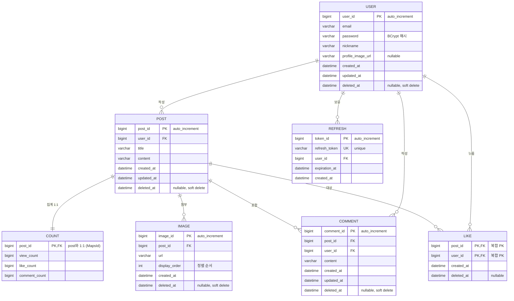

# DB 스키마 구조 분석

> KTB Community 백엔드의 데이터베이스 구조 (JPA 엔티티 기반, MySQL 8.0 / `utf8mb4`)
> 실제 실행 중인 스키마(`information_schema`)에서 추출하여 정리.

## 목차
- [ERD (관계도)](#erd-관계도)
- [테이블 요약](#테이블-요약)
- [테이블 상세](#테이블-상세)
- [관계 정리](#관계-정리)
- [설계 특징 및 관찰 사항](#설계-특징-및-관찰-사항)

---

## ERD (관계도)



> GitHub·VS Code(Mermaid 지원)에서 위 코드가 자동으로 관계도로 렌더링됩니다.

---

## 테이블 요약

| 테이블 | 역할 | PK | 주요 FK |
|---|---|---|---|
| `user` | 회원 | `user_id` | — |
| `post` | 게시글 | `post_id` | `user_id → user` |
| `count` | 게시글 집계(조회/좋아요/댓글 수) | `post_id` | `post_id → post` (1:1) |
| `comment` | 댓글 | `comment_id` | `post_id → post`, `user_id → user` |
| `image` | 게시글 첨부 이미지 | `image_id` | `post_id → post` |
| `like` | 좋아요 (user↔post 다대다) | `(post_id, user_id)` | `post_id → post`, `user_id → user` |
| `refresh` | Refresh Token 저장 | `token_id` | `user_id → user` |

---

## 테이블 상세

### `user` — 회원
| 컬럼 | 타입 | Null | 키 | 비고 |
|---|---|---|---|---|
| user_id | bigint | NO | PK | auto_increment |
| email | varchar(255) | NO | | 로그인 ID |
| password | varchar(255) | NO | | BCrypt 해시 |
| nickname | varchar(255) | NO | | |
| profile_image_url | varchar(255) | YES | | |
| created_at | datetime(6) | NO | | |
| updated_at | datetime(6) | YES | | |
| deleted_at | datetime(6) | YES | | soft delete |

### `post` — 게시글
| 컬럼 | 타입 | Null | 키 | 비고 |
|---|---|---|---|---|
| post_id | bigint | NO | PK | auto_increment |
| user_id | bigint | YES | FK | → user.user_id |
| title | varchar(255) | NO | | |
| content | varchar(255) | NO | | |
| created_at | datetime(6) | NO | | 목록 정렬 기준 |
| updated_at | datetime(6) | YES | | |
| deleted_at | datetime(6) | YES | | soft delete |

**인덱스:** PRIMARY(post_id), FK(user_id) — ⚠️ `created_at` / `deleted_at` 인덱스 없음

### `count` — 게시글 집계 (post와 1:1)
| 컬럼 | 타입 | Null | 키 | 비고 |
|---|---|---|---|---|
| post_id | bigint | NO | PK, FK | post와 PK 공유 (`@MapsId`) |
| view_count | bigint | NO | | 조회수 |
| like_count | bigint | NO | | 좋아요 수 |
| comment_count | bigint | NO | | 댓글 수 |

> 게시글 카운터를 별도 테이블로 분리 → 카운트 갱신 시 post 행 락 경합 회피 목적.

### `comment` — 댓글
| 컬럼 | 타입 | Null | 키 | 비고 |
|---|---|---|---|---|
| comment_id | bigint | NO | PK | auto_increment |
| post_id | bigint | YES | FK | → post.post_id |
| user_id | bigint | YES | FK | → user.user_id |
| content | varchar(255) | NO | | |
| created_at | datetime(6) | NO | | |
| updated_at | datetime(6) | YES | | |
| deleted_at | datetime(6) | YES | | soft delete |

**인덱스:** PRIMARY(comment_id), `idx_comment_post_id`(post_id), FK(user_id)

### `image` — 게시글 이미지
| 컬럼 | 타입 | Null | 키 | 비고 |
|---|---|---|---|---|
| image_id | bigint | NO | PK | auto_increment |
| post_id | bigint | YES | FK | → post.post_id |
| url | varchar(255) | YES | | S3 객체 URL |
| display_order | int | YES | | 이미지 정렬 순서 |
| created_at | datetime(6) | NO | | |
| deleted_at | datetime(6) | YES | | soft delete |

### `like` — 좋아요 (다대다 연결)
| 컬럼 | 타입 | Null | 키 | 비고 |
|---|---|---|---|---|
| post_id | bigint | NO | PK, FK | 복합 PK |
| user_id | bigint | NO | PK, FK | 복합 PK |
| created_at | datetime(6) | NO | | |
| deleted_at | datetime(6) | YES | | |

> `(post_id, user_id)` 복합 PK로 **한 유저의 중복 좋아요를 DB 레벨에서 차단.**
> `like`는 MySQL 예약어라 SQL에서 백틱(`` `like` ``) 필요.

### `refresh` — Refresh Token
| 컬럼 | 타입 | Null | 키 | 비고 |
|---|---|---|---|---|
| token_id | bigint | NO | PK | auto_increment |
| refresh_token | varchar(255) | NO | UNIQUE | |
| user_id | bigint | YES | FK | → user.user_id |
| expiration_at | datetime(6) | YES | | 만료 시각 |
| created_at | datetime(6) | NO | | |

---

## 관계 정리

```
user (1) ──< (N) post          한 유저가 여러 게시글 작성
user (1) ──< (N) comment       한 유저가 여러 댓글 작성
user (1) ──< (N) like          한 유저가 여러 좋아요
user (1) ──< (N) refresh       한 유저의 여러 토큰(디바이스)
post (1) ──  (1) count         게시글 : 집계 = 1:1 (PK 공유)
post (1) ──< (N) comment       게시글에 여러 댓글
post (1) ──< (N) image         게시글에 여러 이미지 (최대 10개)
post (N) ──< like >── (N) user 게시글↔유저 다대다 (좋아요)
```

---

## 설계 특징 및 관찰 사항

### 잘 된 점
- **Soft delete 일관 적용** — 주요 테이블에 `deleted_at`을 두어 물리 삭제 대신 논리 삭제.
- **카운터 테이블 분리(`count`)** — 조회수/좋아요 수 갱신이 게시글 본문 행과 분리되어 락 경합 감소.
- **좋아요 복합 PK** — `(post_id, user_id)`로 중복 좋아요를 애플리케이션이 아닌 DB 제약으로 방지.
- **RTR 구조** — `refresh` 테이블로 Refresh Token을 서버에서 관리(회전·폐기 가능).

### 개선 여지 (성능 벤치마크와 연결되는 지점)
- ⚠️ **`post.created_at` 인덱스 부재** — 게시글 목록은 `ORDER BY created_at DESC`로 조회하는데
  정렬 컬럼에 인덱스가 없어 **매 조회마다 전체 행 filesort** 발생 (10만 건 기준 성능 저하).
  → `(deleted_at, created_at, post_id)` 복합 인덱스 추가로 개선 가능.
- ⚠️ **목록 조회 N+1** — 게시글마다 `count`·`like`·`user`를 개별 조회 → 페이지당 약 60여 개 쿼리.
  → 배치 조회/`join fetch`로 최적화 가능.
- `varchar(255)` 기본값이 `content`(게시글/댓글 본문)에도 적용되어 긴 본문 저장에 제약 → `TEXT` 검토.

> 위 두 개선점(인덱스 / N+1)은 성능 측정 프로젝트(`benchmark/`)에서 Before/After로 정량 측정 중.
